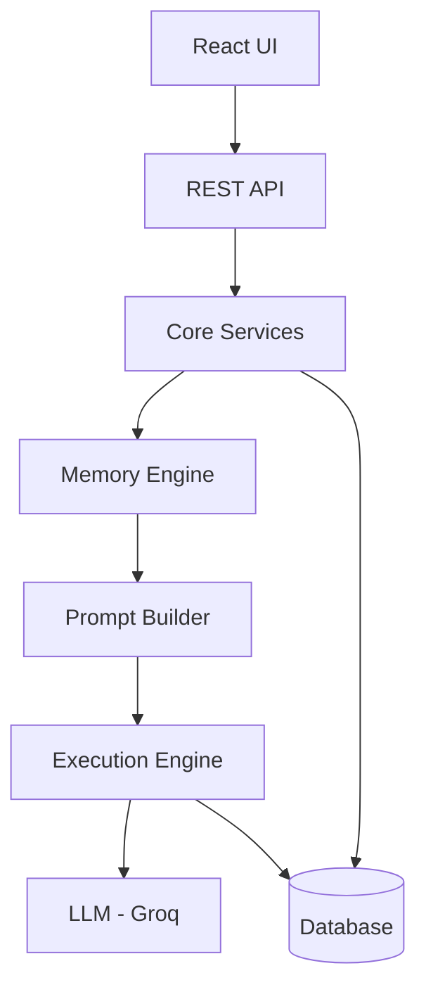
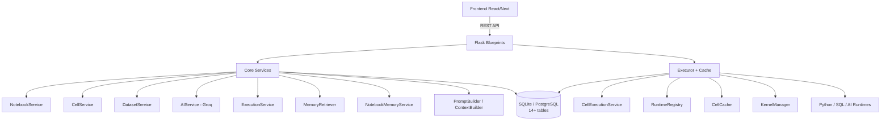
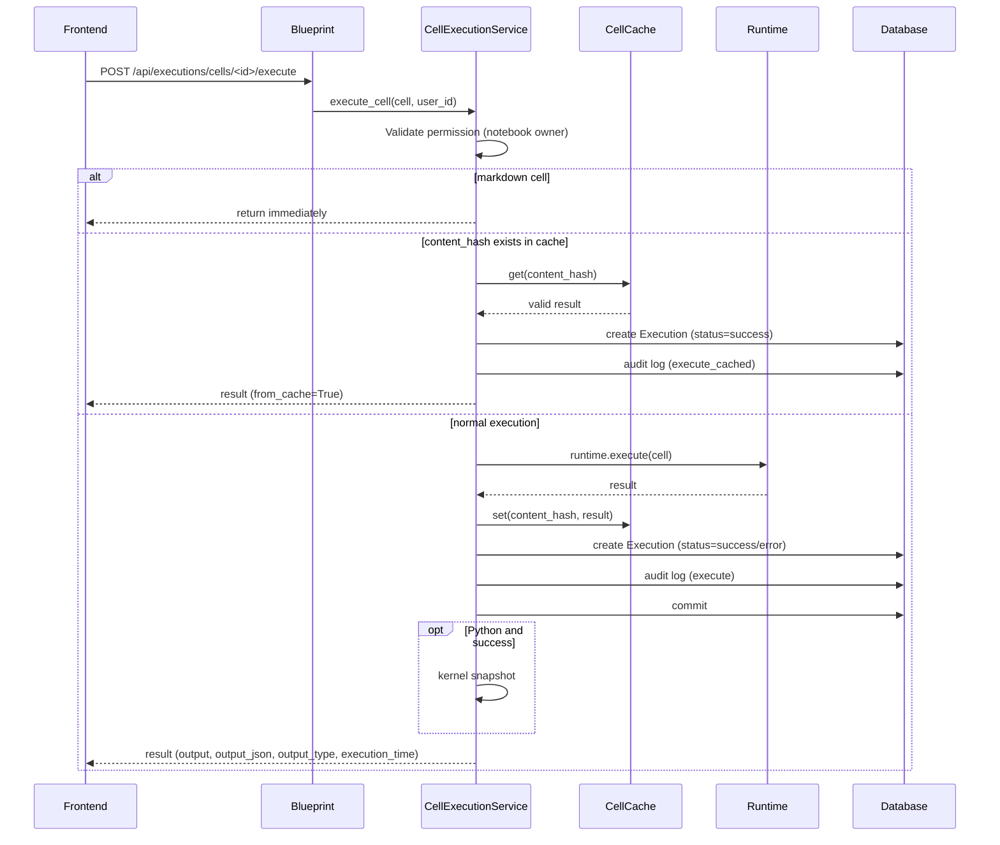

<div align="center">

# 🧪 InDataLab

### AI-Native Notebook Platform for Data Analysis, Code Execution and Intelligent Workflows

[]()
[]()
[]()
[]()

*A Jupyter-style notebook environment with persistent memory, adaptive learning profiles, execution caching, full audit trails, and LLM-powered assistance via Groq.*

[Overview](#-overview) •
[Architecture](#-architecture) •
[Installation](#-installation) •
[API](#-api-endpoints) •
[Roadmap](#-future-ai-roadmap)

</div>

---

## ✨ Highlights

- AI-native notebook platform
- Context-aware memory engine
- Multi-runtime execution (Python, SQL and AI)
- Modular, service-oriented architecture
- Intelligent execution cache
- Prompt orchestration
- Persistent notebook memory
- Full audit trail on every operation
- Production-ready REST APIs
- Scalable backend architecture

---

## 🎯 Why InDataLab?

Traditional notebook environments execute code.

**InDataLab executes code while understanding context.**

The platform combines notebooks, persistent memory, AI reasoning, execution history, dataset management, and intelligent automation into a single environment designed for modern AI-powered development.

---

## 📋 Overview

**InDataLab** is an interactive notebook platform that combines **Python**, **SQL**, **AI**, and **Markdown** in a single environment. Unlike a traditional Jupyter Notebook, InDataLab offers:

- 🧠 **Persistent contextual memory** — the AI learns from each notebook's history
- ⚡ **Intelligent execution cache** — avoids reprocessing unchanged cells
- 🔍 **Full audit trail** — every action is logged
- 🤖 **Built-in AI via Groq** — contextual chat and assistance directly in the notebook
- 📊 **Learning profile** — the platform adapts to the libraries and topics used most

> **Current status:** `0.9-beta` — core architecture and services are implemented and consolidated. Vector search, dependency DAG, and asynchronous execution are still needed to reach a fully production-hardened 10/10.

---

## 🔧 Engineering Challenges Solved

- ✔ Persistent contextual memory
- ✔ Intelligent execution cache
- ✔ Runtime isolation
- ✔ Dataset management
- ✔ AI conversation history
- ✔ Prompt orchestration
- ✔ Notebook profiling / adaptive learning
- ✔ Modular service architecture
- ✔ Execution auditing
- ✔ Extensible runtime engine

---

## 🏗️ Architecture

The platform is built on a layered architecture that separates business logic, execution, AI orchestration, and persistence.

**Core principles:**
- Separation of concerns
- Modular services
- Runtime isolation
- Extensible AI architecture
- Stateless APIs
- Persistent contextual memory

**High-level flow:**



**Detailed service map:**



### Directory Structure

```
InDataLab/
├── app/
│   ├── __init__.py            # creates the Flask app, registers blueprints
│   ├── models/                # SQLAlchemy models
│   │   ├── notebook.py
│   │   ├── cell.py
│   │   ├── dataset.py
│   │   ├── execution.py
│   │   ├── cell_version.py
│   │   ├── cell_cache.py
│   │   ├── cell_dependency.py
│   │   ├── notebook_memory.py
│   │   ├── notebook_profile.py
│   │   ├── ai_conversation.py
│   │   ├── ai_conversation_session.py
│   │   └── audit_log.py
│   ├── services/               # service layer
│   │   ├── notebook_service.py
│   │   ├── cell_service.py
│   │   ├── dataset_service.py
│   │   ├── execution_service.py
│   │   ├── ai_service.py
│   │   ├── audit_service.py
│   │   ├── notebook_memory_service.py
│   │   ├── memory_retriever.py
│   │   ├── memory_extractor.py
│   │   ├── prompt_builder.py
│   │   ├── context_builder.py
│   │   └── cell_export_service.py
│   ├── executor/                # cell execution
│   │   ├── executor_service.py  # cache- and audit-aware orchestrator
│   │   ├── runtimes/            # PythonRuntime, SQLRuntime, AIRuntime
│   │   ├── kernel_manager.py    # per-notebook isolated namespaces
│   │   └── runtime_registry.py
│   ├── routes/                  # Blueprints
│   │   ├── notebooks_blueprint.py
│   │   ├── cells_blueprint.py
│   │   ├── datasets_blueprint.py
│   │   ├── executions_blueprint.py
│   │   ├── ai_blueprint.py
│   │   └── system_routes.py
│   └── utils/                   # helpers (json_utils, etc.)
├── migrations/                  # Alembic (where applicable)
├── uploads/                      # dataset files (organized by notebook)
├── .env                          # environment variables (GROQ_API_KEY, etc.)
├── requirements.txt
└── run.py
```

---

## 🗄️ Core Data Models

| Table | Description |
|---|---|
| `users` | Platform users |
| `notebooks` | Notebooks (title, kernel_type, owner) |
| `cells` | Cells (type, content, position, output, tags, version, content_hash) |
| `cell_versions` | Content snapshots (versioning) |
| `cell_cache` | Execution result cache (code hash + TTL) |
| `cell_dependencies` | Cell-to-cell dependencies (for future DAG) |
| `datasets` | Imported datasets (relative path, metadata, is_sql_database) |
| `executions` | Execution history (status, duration, logs) |
| `notebook_memories` | AI contextual memories (summary, datasets_used, variables_used, metadata) |
| `notebook_profiles` | Learning profile (favorite libraries, topics, intents) |
| `ai_conversations` | Messages exchanged with the AI (user/assistant, tokens, model) |
| `ai_conversation_sessions` | Conversation sessions used to preserve context |
| `audit_logs` | Action log (create, update, delete, execute) |

---

## ⚙️ Core Services

<details>
<summary><strong>NotebookService</strong></summary>

- Full CRUD with permission validation
- Integrated with `AuditService`
- Tears down the kernel session when a notebook is deleted
</details>

<details>
<summary><strong>CellService</strong></summary>

- Create, update, move, and reorder cells
- Soft delete with position renormalization
- Automatic versioning via `CellVersion`
- Normalized tags
- Auditing on every operation
</details>

<details>
<summary><strong>DatasetService</strong></summary>

- Upload support for CSV, Excel, JSON, Parquet, and SQLite
- Metadata calculation (rows, columns, column names) via `DatasetLoader`
- Detects SQLite files and sets them as the notebook's default connection
- Upload/delete auditing
- `load_dataset_data` for previews
</details>

<details>
<summary><strong>ExecutionService</strong></summary>

- Logs executions (history) with status `pending/running/success/error`
- Validates permissions via `_validate_user_owns_cell`
- Auditing on create and update
- Aggregated statistics computed in SQL (avoids loading every execution)
</details>

<details>
<summary><strong>AIService (Groq)</strong></summary>

- Communicates with LLMs (llama, mixtral) with retry (`tenacity`) and timeout handling
- Conversations and sessions persisted to `ai_conversations` and `ai_conversation_sessions`
- Integrated with `MemoryExtractor` and `NotebookMemoryService` to store contextual memories
- Retrieves relevant memories via `MemoryRetriever` and optionally injects them into the system prompt
- Prometheus metrics (count, latency, tokens)
- Auditing on every interaction
</details>

<details>
<summary><strong>CellExecutionService (Executor)</strong></summary>

- Orchestrates cell execution: markdown, Python, SQL, AI
- **Integrated cache:** checks `CellCache` by `content_hash` before executing; if a valid entry exists, applies the cached result and returns immediately
- After a real execution, stores the result in cache (on success)
- Updates the `cell` record (output, status, execution_count, last_executed_at)
- Creates an `Execution` record in the history table
- Audits the execution (including cache hits)
- Snapshots the kernel (for Python cells) after commit
</details>

<details>
<summary><strong>Memory & Profile</strong></summary>

- **`MemoryExtractor`**: extracts libraries, datasets, variables, DataFrames, columns, intent, and topics from the prompt and response
- **`NotebookMemoryService`**: persists AI interactions to `notebook_memories`, with structured metadata
- **`MemoryRetriever`**: retrieves relevant memories using lexical scoring (topics, intents, datasets, libraries, recency) — *future: vector search with embeddings*
- **`NotebookProfileService`**: updates the notebook's profile (favorite libraries, datasets, topics, intents) from stored memories
- **`PromptBuilder`**: builds the system prompt using dataset context, kernel state, recent history, memories, and profile
</details>

---

## 🔄 Cell Execution Flow



---

## 🔐 Audit System

- `AuditLog` model with fields: `user_id`, `entity_type`, `entity_id`, `action`, `old_data`, `new_data`, `created_at`
- `AuditService.log()` adds a record to the session (no automatic commit)
- All core services (Notebook, Cell, Dataset, Execution, AI) call `AuditService.log` on create, update, delete, and execute operations
- **Best practice:** call `db.session.flush()` before auditing to guarantee the entity has an ID

---

## ⚡ Execution Cache

- `cell_cache` table indexed by `content_hash`
- Default TTL of **24 hours**, refreshed on every access (`touch()`)
- `get(content_hash)` (checks expiration) and `set(...)` (replaces the previous entry)
- **Integrated with the executor:** avoids re-running cells with identical content (as long as external dependencies haven't changed — pending)
- **Planned:** invalidate the cache automatically when dependencies change (via DAG)

---

## 🔌 API Endpoints

| Method | Endpoint | Description |
|---|---|---|
| `GET` | `/api/notebooks` | List a user's notebooks |
| `POST` | `/api/notebooks` | Create a notebook |
| `GET` | `/api/notebooks/<id>/cells` | List a notebook's cells |
| `POST` | `/api/notebooks/<id>/cells` | Create a cell |
| `PUT` | `/api/cells/<id>` | Update a cell |
| `DELETE` | `/api/cells/<id>` | Soft delete a cell |
| `POST` | `/api/executions/cells/<id>/execute` | Execute a cell |
| `GET` | `/api/cells/<id>/executions` | Execution history |
| `POST` | `/api/notebooks/<id>/datasets` | Upload a dataset |
| `GET` | `/api/datasets/<id>/data` | Preview data |
| `POST` | `/api/ai/chat` | Chat with AI (requires `notebook_id`) |
| `GET` | `/api/notebooks/<id>/memories` | Contextual memories |
| `GET` | `/api/system/status` | Health check |

*(13 primary routes documented above; see `app/routes/` for the full set, including nested resource endpoints.)*

---

## 🧩 Design Decisions

- **Clear separation between models, services, and routes** — simplifies testing and maintenance
- **Permission validation in every service** — `notebook.user_id` vs `user_id`
- **Flush before auditing** — guarantees the entity has an ID
- **TTL-based cache** — prevents unbounded growth; refreshed on every access
- **Cell versioning** — automatic snapshots on content change
- **Soft delete with position renormalization** — preserves ordering integrity (0, 1, 2, …)
- **Synchronous executor** — designed to migrate to a Celery queue later
- **Hybrid memory strategy** — lexical retrieval today, vector-based in the future
- **Structured logging** via the standard `logging` module
- **Prometheus metrics** in AIService (optional)

---

## 🛠️ Tech Stack

| Layer | Technologies |
|---|---|
| **Backend** | Flask, SQLAlchemy, Flask-Migrate |
| **Database** | SQLite (dev) / PostgreSQL (production, `pgvector` planned) |
| **LLM** | Groq API (`llama-3.3-70b-versatile`, etc.) |
| **Python execution** | Subprocess (isolated runtime) |
| **SQL** | Embedded SQLite via runtime |
| **Containers** *(planned)* | Docker, Celery, Redis |
| **Monitoring** | Prometheus, structured logs |

---

## 📊 Implementation Status

| Component | Status | Notes |
|---|---|---|
| Notebook CRUD | ✅ Complete | With auditing and kernel manager |
| Cell CRUD | ✅ Complete | Versioning, tags, soft delete |
| Datasets | ✅ Complete | Upload, base metadata, kernel-level caching |
| Python/SQL execution | ✅ Complete | Functional runtimes |
| AI execution | ✅ Complete | Integrated with Groq and memory |
| Execution cache | ✅ Integrated | In the executor, with TTL |
| Auditing | ✅ Integrated | Across all core services |
| Execution history | ✅ Complete | ExecutionService with aggregated stats |
| Contextual memory | ✅ Lexical | Embeddings pending |
| Learning profile | ✅ Basic | Collected and updated from memories |
| Dependencies (DAG) | 🟡 Partial | Model ready, analyzer pending |
| Async execution | ❌ Pending | Planned with Celery |
| Vector search | ❌ Pending | Planned with pgvector |
| Automated tests | ❌ Pending | — |
| Docker deployment | ❌ Pending | — |

---

## 📈 Project Metrics

| Metric | Value |
|---|---|
| Architecture layers | 6 (Frontend, API, Core Services, Executor, Memory Engine, Database) |
| Core services & modules | 15+ (`app/services` + `app/executor`) |
| Database models | 14+ |
| Documented REST endpoints | 13+ (primary routes) |
| Supported runtimes | Python, SQL, AI |
| Supported databases | SQLite, PostgreSQL |
| Status | Beta (`0.9-beta`) |

> Service and endpoint counts reflect what's documented above; run a quick `grep` over `app/services`, `app/executor`, and `app/routes` before publishing if you want an exact, code-verified number.

---

## 🗺️ Future AI Roadmap

- [ ] **Vector search** — `embedding` field on `notebook_memory`, generated via `sentence-transformers`, cosine similarity with `pgvector`
- [ ] **Semantic memory** — move beyond lexical scoring to embedding-based retrieval
- [ ] **Cell dependencies (DAG)** — `DependencyAnalyzer` (static analysis) integrated into `CellService`, with chained re-execution
- [ ] **Asynchronous execution** — migrate `CellExecutionService.execute_cell` to a Celery queue with `task_id` tracking via WebSocket/polling
- [ ] **Agent collaboration / multi-agent orchestration** — coordinate specialized agents across notebook workflows
- [ ] **MCP integration (Model Context Protocol)** — expose InDataLab's tools and data through MCP for use by external AI clients
- [ ] **Tool calling & autonomous workflows** — let the AI trigger multi-step actions inside the notebook
- [ ] **Hybrid search** — combine lexical and vector retrieval for memory lookups
- [ ] **Security sandbox** — isolate Python execution in Docker or `nsjail`
- [ ] **Rate limiting** — `flask-limiter` on AI and execution routes
- [ ] **Unit and integration tests** — coverage for the core services
- [ ] **OpenAPI/Swagger documentation**
- [ ] **Metrics dashboard** — Grafana + Prometheus

---

## 💡 Why This Project Matters

Modern AI applications require far more than simply calling an LLM API.

They require contextual memory, execution orchestration, intelligent caching, data management, prompt engineering, and scalable architecture.

InDataLab was designed to address these engineering challenges through a modular, extensible architecture — treating the notebook not just as a code runner, but as a stateful, context-aware workspace.

---

## 🚀 Installation

### Prerequisites

- Python 3.12+
- SQLite (or PostgreSQL)
- Groq API key

### Steps

```bash
git clone https://github.com/Foxactive1/InDataLab.git
cd InDataLab
python -m venv venv
source venv/bin/activate  # Windows: .\venv\Scripts\activate
pip install -r requirements.txt
cp .env.example .env      # edit with your GROQ_API_KEY
flask db upgrade           # if using migrations
flask run
```

Access it at: **http://localhost:5000**

### Environment Variables

| Variable | Description |
|---|---|
| `GROQ_API_KEY` | Groq API key |
| `GROQ_MODEL` | Default model (`llama-3.3-70b-versatile`) |
| `UPLOAD_FOLDER` | Dataset upload directory |
| `DATABASE_URL` | Connection string (`sqlite:///indatalab.db`) |

---

## 👤 About the Author

**Dione Castro Alves** — Software Engineer focused on AI Systems, Backend Engineering, and Intelligent Automation.

Founder of **InNovaIdeia Assessoria em Tecnologia®**, building production-grade AI platforms and scalable software architectures since 2009.

[](https://github.com/Foxactive1)
[](mailto:innovaideia2023@gmail.com)

---

<div align="center">

*Documentation generated on 07/19/2026 — reflects the project's consolidated architecture.*

</div>
